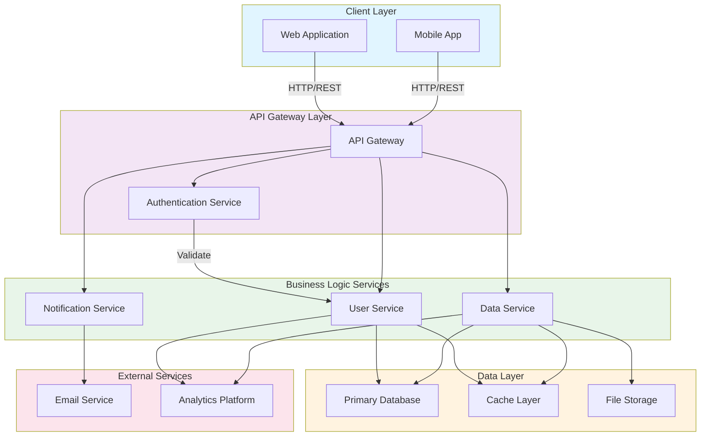

# Architecture Overview

This document provides a visual overview of the system architecture.

## System Architecture Diagram

## Architecture Components

### Client Layer
- **Web Application**: Browser-based user interface
- **Mobile App**: Native or cross-platform mobile application

### API Gateway Layer
- **API Gateway**: Central entry point for all client requests
- **Authentication Service**: Handles user authentication and authorization

### Business Logic Services
- **User Service**: Manages user profiles and account operations
- **Data Service**: Handles core business data operations
- **Notification Service**: Manages notifications and communications

### Data Layer
- **Primary Database**: Main persistence layer for application data
- **Cache Layer**: In-memory caching for performance optimization
- **File Storage**: Blob/object storage for files and media

### External Services
- **Email Service**: Third-party email delivery
- **Analytics Platform**: User behavior and performance tracking

## Data Flow

1. Clients submit requests through the API Gateway
2. Gateway routes to appropriate services after authentication
3. Services process requests and interact with data layers
4. External services are called for email and analytics
5. Response flows back through gateway to clients
